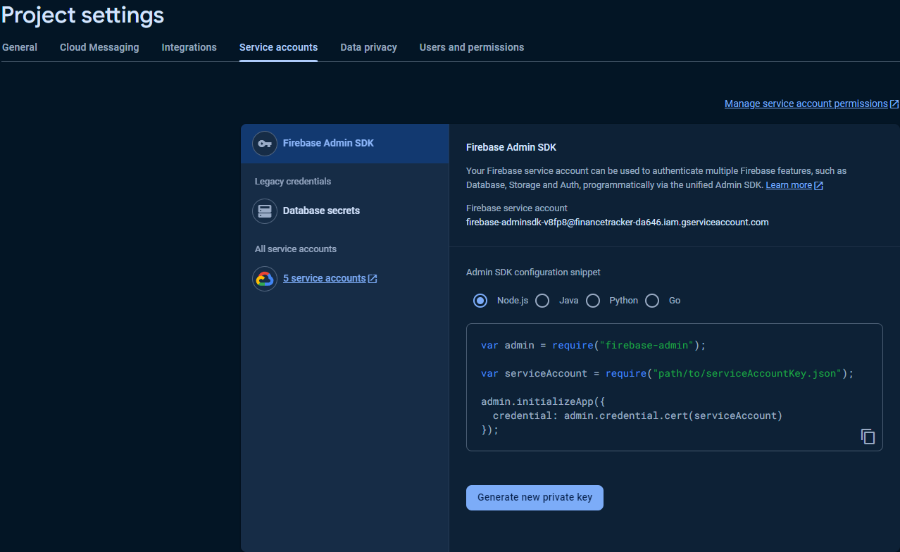
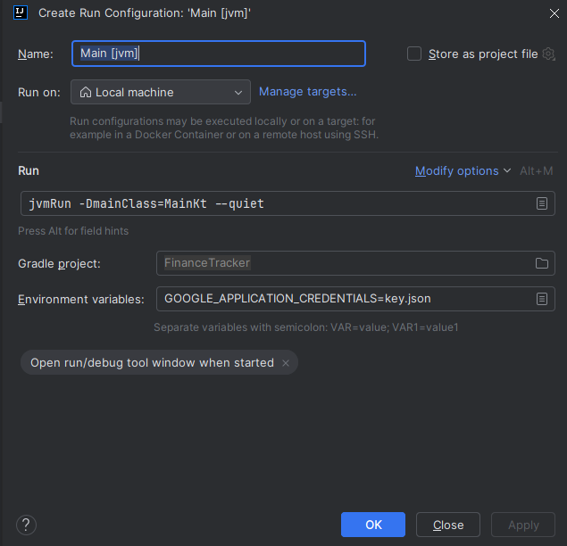
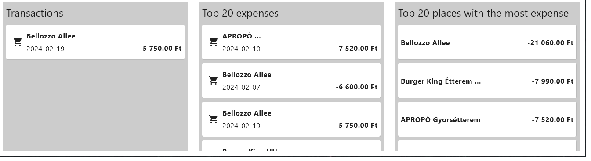

# FinanceTracker 

### 1. Step

Download the project and open it with IntelliJ.

### 2. Step

In the project structure, change SDK and language level to 21, then press Apply and OK.

### 3. Step

Create a Firebase project, navigate to the _Service accounts_ menu and _Generate new private key_. Rename it to `key.json` file and put it in the root of the project.

### 4. Step

In the Project Explorer (left side), select _Main.kt_, search for `fun main()`, press the green arrow and select _Modify Run Configuration_. After that, in the environmental variables, insert the following command: `GOOGLE_APPLICATION_CREDENTIALS=key.json`, then press Apply and OK.

### 5. Step 

Run Main and **enjoy** the app!:)

### Notes:
- In the beginning, database is empty, you can add new entries with the green button under the Date text field. You can select which kind of file you want to upload from.
- Data is stored by Firebase, so if you uploaded any data and restart the app, same entries are shown up again.
- Program prevents duplicated entries 
- Cards in the top left corner are recalculated every time based on the date and the selected interval.
- Graph in the top right corner show the total income and expense for the last 6 months.
- We can control the date and the interval based on what we are interested in. (1 day, full month, full year)
- In the last row, first table show the previous entries based on the date and the interval. (scrollable)
- Second table show the top 20 expenses from history. (Date and interval have no effect on it)
- Third table show the top 20 places, where the most money was spent. (Date and interval have no effect on it)
- Cards in the tables are clickables, so if we want to read the full infos about the entry, we can do it (Infos are shortened with ... end for readability)

